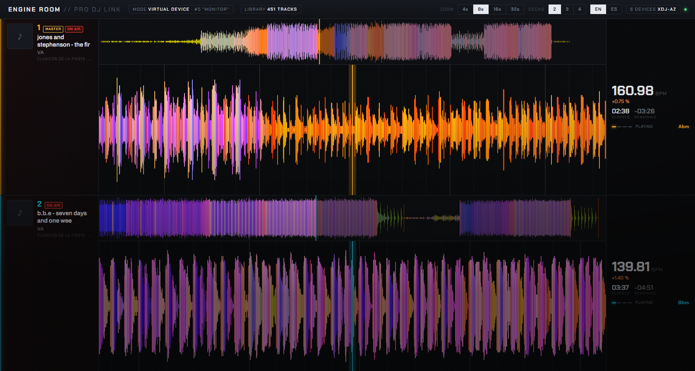

# prolink-monitor

Reads, live, what an AlphaTheta / Pioneer DJ player is doing on the network: which
track sits on each deck, how far into it, at what tempo and key, and draws its
waveform with a moving playhead.

It talks to the gear directly. No external Python packages.



---

## Tested on

**An AlphaTheta XDJ-AZ (firmware 1.30), on Windows 11, and nothing else.**

Every field offset, the NFS access and the waveform decoding were verified against
that one unit. It has never been run on macOS or Linux.

Two things were written with separate players in mind, both untested:

- the medium is read from whichever player the track reports it was *loaded from*,
  rather than from one fixed address;
- the NFS file-name encoding is detected rather than assumed (the XDJ-AZ uses
  UTF-16LE).

If you try it, on any player or any operating system, an issue saying what worked
and what did not is very welcome.

---

## What it shows

Per deck:

- **Track**: title, artist, album, genre, label, year and artwork.
- **Position**: elapsed and remaining time, absolute beat and position in the bar.
- **Tempo**: effective BPM (track tempo with the fader applied), pitch percentage,
  musical key.
- **State**: playing / cued / paused / end of track, plus the `MASTER`, `SYNC` and
  `ON AIR` flags.
- **Waveform**: the detail view scrolling under a fixed playhead, with the bar grid
  and cue points; above it, an overview of the whole track with the played part lit.

The panel pulses on the downbeat of every deck that is playing.

The header has switches for the **waveform zoom** (4 / 8 / 16 / 32 seconds, also
`+` and `-` on the keyboard) and for how many **decks** to show at once (2, 3 or 4 —
fewer decks means a taller waveform each). Decks holding a track are shown first.
Both choices, and the language, are remembered.

### Language

The interface is in English by default and switches to Spanish when the browser
asks for it. There is an EN/ES switch in the header, and the choice sticks.
Everything else — code, console output, logs — is English only.

---

## Requirements

- **Python 3.10 or newer**, no packages needed.
- The computer and the player on the **same network**.
- **Wireshark / Npcap** ([wireshark.org](https://www.wireshark.org)) — only to run
  this while rekordbox is open.

| Your situation | What runs | Npcap |
|---|---|---|
| rekordbox closed | virtual device mode, plain UDP sockets | not needed |
| rekordbox open | passive capture | **required** |

---

## Usage

```bash
python app.py
```

It finds the player, picks a mode, starts the server and opens
<http://127.0.0.1:8777/>.

| Option | What it does |
|---|---|
| `--host 192.168.2.100` | player address (auto-detected when omitted) |
| `--mode vcdj` | force virtual device mode |
| `--mode sniffer` | force passive capture |
| `--number 5` | device number to announce as (1-6) |
| `--port 8777` | web server port |
| `--iface` | capture interface for sniffer mode (see `tshark -D`) |
| `--no-open` | do not open a browser |

There is a console monitor too, no browser involved:

```bash
python monitor.py
```

### Protocol probe

To find out whether some control on the player travels over the network:

```bash
python probe.py
```

It learns the idle state for five seconds, then prints every byte that changes,
naming the field when it knows it. Move the control you want to check: if nothing
appears, that data is not transmitted.

Bytes that took more than two values while learning are dropped as counters. `--all`
keeps them. It reports how many bytes it is watching, and runs alongside the panel.

---

## The two modes

The player **does not broadcast its status**: it sends it by unicast, and only to
addresses that announced themselves beforehand. Beat packets and keep-alives are
broadcast; the detailed status is not.

### Virtual device mode (`--mode vcdj`)

Announces itself on port 50000 as one more device, after which the player sends its
status to us directly. The keep-alive is byte-for-byte identical to the one
rekordbox emits, with only the name, device number, MAC and IP changed.

Needs rekordbox closed: it claims UDP 50000-50002 exclusively and Windows returns
`WSAEACCES` to anything else.

An XDJ-AZ takes device numbers 1-4 plus 33 (the mixer section) and rekordbox uses
17, so the default is **5**.

### Passive mode (`--mode sniffer`)

Captures through Npcap, which sits below the socket layer, so it reads the packets
Windows is handing to rekordbox without opening a port. It needs some other program
linked to the player: close rekordbox and it goes quiet.

### `auto` (the default)

Uses the virtual device when port 50002 is free, passive capture when it is not.

---

## How it works

### Live state — Pro DJ Link (UDP)

| Port | Contents |
|---|---|
| 50000 | keep-alive: who is on the network (broadcast) |
| 50001 | beats: arrives exactly on the beat, with tempo and position in the bar |
| 50002 | detailed status of each player (unicast) |
| 50004 | mixer packet, type 0x20: 44 bytes at ~140 Hz, and only a counter inside |

The XDJ-AZ status packet is 292 bytes. Field offsets are verified against real
captures from the unit.

#### The playhead

Position is a continuous model (base position, base time, speed), corrected by
20 % of the error per observation and re-placed outright only past 400 ms, the
threshold for a cue or a seek rather than noise.

Each beat's instant comes from the **beat packet**, which arrives on the beat; the
status packet lags it by a variable 2-50 ms. In passive mode the timestamp is
`frame.time_epoch`, tshark's capture time, since tshark delivers its output in
batches and read time says nothing about arrival time.

Measured on the real stream: ±1.3 ms.

### Metadata and waveforms — NFS

The player exports the inserted USB/SD over **NFS v2 on UDP**. That is where
these come from:

- `PIONEER/rekordbox/export.pdb` — the rekordbox database: tracks, artists, albums,
  genres, keys, labels and artwork paths.
- `PIONEER/USBANLZ/.../ANLZ0000.DAT` / `.EXT` / `.2EX` — per-track analysis: beat
  grid, cues, phrases and the waveforms.
- `PIONEER/Artwork/...` — the artwork itself.

This route needs no device number, unlike the dbserver protocol: an XDJ-AZ
occupies all four player numbers.

Cached in `~/.prolink-cache/<ip>/`.

### Waveforms

`PWV5` (colour detail, 150 columns per second) is preferred. Each column is two
bytes: the height in bits 2-6 plus three 3-bit frequency bands. The band layout was
worked out by correlating those fields against `PWV7`, which does label them:

| Bits | Band | Channel |
|---|---|---|
| 13-15 | lows | blue |
| 10-12 | mids | green |
| 7-9 | highs | red |

A track without `PWV5` falls back to `PWV7` (three bands) with the same colour
scheme, and finally to `PWV3` (the classic blue waveform). The overview is generated
by reducing the detail waveform, taking the peak of each window, rather than using
`PWV4`, whose colour layout is not clear.

Drawing takes the peak of **every** column falling inside a pixel. At 150 columns
per second there are usually more columns than pixels, and sampling just one of them
drops transients.

---

## The mixer channels

The mixer reports an **ON AIR** flag per channel, computed by the mixer section and
carried in each deck's status packet (bit 0x08 of the flags, byte 0x89). It tracks
the channel fader.

Verified on the unit with `probe.py`, closing the faders:

```
dev 3  byte 0x89: 0xBC -> 0xB4     (base+on air+sync+master  ->  base+sync+master)
dev 1  byte 0x89: 0x9C -> 0x94     (base+on air+sync         ->  base+sync)
dev 2  byte 0x89: 0x9C -> 0x94
dev 4  byte 0x89: 0x9C -> 0x94
```

The same state is duplicated in field **0x26-0x27**: `0x0100` open, `0x0000`
closed. The reference documentation describes that field as "activity" (0 idle, 1
playing), which does not hold here: two decks measured `0x0100` and two `0x0000`
with all four tracks stopped.

The panel shows this with an `ON AIR` tag, a `CHANNEL CLOSED` tag, and by dimming
decks whose channel is closed.

**The position of faders, volumes and EQ is not transmitted.** Moving the channel
faders up and down with the probe watching 1548 of 1548 bytes, unfiltered, changed
that one bit and nothing else.

---

## Layout

```
app.py              web server and API
monitor.py          console monitor
probe.py            protocol probe: reports bytes that change
web/index.html      the panel
prolink/
  proto.py          Pro DJ Link packets (keep-alive, beat, status)
  link.py           engine: virtual device, passive capture, deck state
  nfs.py            ONC-RPC / MOUNT / NFS v2 client
  pdb.py            export.pdb parser
  anlz.py           analysis file parser (waveforms, beats, cues)
  library.py        ties NFS + database + analysis together, with caching
```

### API

| Route | Returns |
|---|---|
| `/api/state` | full state as JSON |
| `/api/events` | the same state over SSE, 20 times a second |
| `/api/track/<id>` | metadata, beat grid, cues and phrases |
| `/api/waveform/<id>` | waveforms in binary: detail and overview |
| `/api/artwork/<id>` | artwork as JPEG |

`/api/waveform/<id>` format: two blocks back to back (detail then overview), each
with a 24-byte little-endian header — `PLWF`, version, column count, columns per
second (float), duration in ms, flags — followed by the heights (1 byte, 0-31) and
the RGB (3 bytes per column).

State is sent with **stable keys**, not display text (`playing`, `cued`, `usb`...);
the interface translates them.

---

## Troubleshooting

**"could not open UDP port 50000".** rekordbox is running. Close it, or use
`--mode sniffer`.

**No decks show up in virtual device mode.** Check the player is powered on and on
the same subnet, and that the number you are using (`--number`) is not already taken.
Devices seen are listed in the panel header even before their status arrives.

**No decks show up in passive mode.** This mode only sees status while another
program is linked to the player. With rekordbox closed, use virtual device mode.

**"could not find interface".** Pass it by hand: `--iface` with the number `tshark -D`
lists.

**Auto-detection picks the wrong address.** On machines with VMware or Hyper-V
installed there are several virtual adapters. Pass `--host` with the player's
address.

**The track shows but the waveform does not.** The USB drive has to be inserted in
the player and carry rekordbox analysis. The header shows whether the library loaded
and how many tracks it has.

---

## Credits

The protocol work this builds on is not mine:

- [dysentery](https://github.com/Deep-Symmetry/dysentery) and
  [crate-digger](https://github.com/Deep-Symmetry/crate-digger) by Deep Symmetry,
  which document the packets, `export.pdb` and the analysis files.
- The reverse engineering by [@henrybetts](https://github.com/henrybetts) and
  [@flesniak](https://github.com/flesniak) that those projects are built on.

This is an independent implementation, not affiliated with or endorsed by
AlphaTheta / Pioneer DJ.
